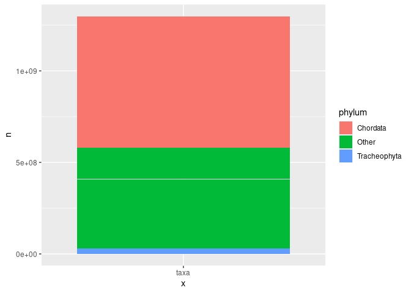

<!-- README.md is generated from README.Rmd. Please edit that file -->

# gbifdb

<!-- badges: start -->

[](https://github.com/cboettig/gbifdb/actions)
<!-- badges: end -->

The goal of `gbifdb` is to provide a relational database interface to a
`parquet` based serializations of `gbif` data. Instead of requiring
custom functions for filtering and selecting data from the central GBIF
server (as in `rgbif`), `gbifdb` users can take advantage of the full
array of `dplyr` and `tidyr` functions which can be automatically
translated to SQL by `dbplyr`. Users already familiar with SQL can
construct SQL queries directly with `DBI` instead. `gbifdb` sends these
queries to [`duckdb`](https://duckdb.org), a high-performance,
columnar-oriented database engine which runs entirely inside the client,
(unlike server-client databases such as MySQL or Postgres, no additional
setup is needed outside of installing `gbifdb`.) `duckdb` is able to
execute these SQL queries directly on-disk against the Parquet data
files, side-stepping limitations of available RAM or the need to import
the data. It’s highly optimized implementation can be faster even than
in-memory operations in `dplyr`, especially when using fast SSD-based
storage disks. Unlike the `arrow` R packae interface, which can also
query `parquet` files, `duckdb` supports the full set of SQL
instructions, including windowed operations like `group_by`+`summarise`
as well as table joins.

## Installation

**NOTE**: `gbifdb` currently requires the dev version of `duckdb`, which
you can install using:

``` r
install.packages("https://github.com/duckdb/duckdb/releases/download/master-builds/duckdb_r_src.tar.gz", repos = NULL)
```

<!--

You can install the released version of `gbifdb` from [CRAN](https://CRAN.R-project.org) with:

``` r
install.packages("gbifdb")
```

-->

And the development version from [GitHub](https://github.com/) with:

``` r
# install.packages("devtools")
devtools::install_github("cboettig/gbifdb")
```

`gbifdb` has few dependencies: only `duckdb` and `DBI` are required.

## Getting Started

``` r
library(gbifdb)
library(dplyr)  # optional, for dplyr-based operations
library(aws.s3) # optional, for S3-based sync
```

Before you can use `gbifdb` you will need to download GBIF data.
Alternatively, many users may choose to launch an RStudio-server
instance on a cloud platform that already has a local copy of the GBIF
data available.

Data can be downloaded by registering at GBIF portal, or directly from
various cloud provider copies, including the AWS GBIF public data
catalog, <https://registry.opendata.aws/gbif/>, or the Microsoft Cloud,
<https://planetarycomputer.microsoft.com/dataset/gbif>, which include
directions for direct download or syncing through various client
software.

Once you have downloaded the parquet-formatted GBIF data, simply point
`gbif_conn()` at the directory containing your parquet files to
initialize a connection.

``` r
conn <- gbif_conn()
```

The resulting connection can be used with `dplyr::tbl()` to access the
full gbif data:

``` r
gbif <- tbl(conn, "gbif")
gbif
#> # Source:   table<gbif> [?? x 50]
#> # Database: duckdb_connection
#>        gbifid datasetkey  occurrenceid   kingdom phylum class order family genus
#>         <dbl> <chr>       <chr>          <chr>   <chr>  <chr> <chr> <chr>  <chr>
#>  1 1572326202 0e2c20a3-3… 7B3E9B63FF90F… Animal… Arthr… <NA>  Aran… Capon… Medi…
#>  2 1572326211 0e2c20a3-3… 7B3E9B63FF8BF… Animal… Arthr… <NA>  Aran… Capon… Medi…
#>  3 1572326213 0e2c20a3-3… 7B3E9B63FF96F… Animal… Arthr… <NA>  Aran… Capon… Medi…
#>  4 1572326222 0e2c20a3-3… 7B3E9B63FF8EF… Animal… Arthr… <NA>  Aran… Capon… Medi…
#>  5 1572326224 0e2c20a3-3… 7B3E9B63FF8FF… Animal… Arthr… <NA>  Aran… Capon… Medi…
#>  6 1572326210 0e2c20a3-3… 7B3E9B63FF92F… Animal… Arthr… <NA>  Aran… Capon… Medi…
#>  7 1572326209 0e2c20a3-3… 7B3E9B63FF8BF… Animal… Arthr… <NA>  Aran… Capon… Medi…
#>  8 1572326215 0e2c20a3-3… 7B3E9B63FF8FF… Animal… Arthr… <NA>  Aran… Capon… Medi…
#>  9 1572326228 0e2c20a3-3… 7B3E9B63FF8EF… Animal… Arthr… <NA>  Aran… Capon… Medi…
#> 10 1572326205 0e2c20a3-3… 7B3E9B63FF8BF… Animal… Arthr… <NA>  Aran… Capon… Medi…
#> # … with more rows, and 41 more variables: species <chr>,
#> #   infraspecificepithet <chr>, taxonrank <chr>, scientificname <chr>,
#> #   verbatimscientificname <chr>, verbatimscientificnameauthorship <chr>,
#> #   countrycode <chr>, locality <chr>, stateprovince <chr>,
#> #   occurrencestatus <chr>, individualcount <int>, publishingorgkey <chr>,
#> #   decimallatitude <dbl>, decimallongitude <dbl>,
#> #   coordinateuncertaintyinmeters <dbl>, coordinateprecision <dbl>, …
```

Now, we can use `dplyr` to perform standard queries:

``` r
phyla <- count(gbif, phylum, countrycode, sort = TRUE)
phyla
#> # Source:     lazy query [?? x 3]
#> # Database:   duckdb_connection
#> # Groups:     phylum
#> # Ordered by: desc(n)
#>    phylum       countrycode         n
#>    <chr>        <chr>           <dbl>
#>  1 Chordata     US          501545951
#>  2 Chordata     CA           74214109
#>  3 Chordata     SE           70602442
#>  4 Chordata     AU           46810397
#>  5 Tracheophyta FR           29257364
#>  6 Chordata     ZA           23833456
#>  7 Chordata     NO           22963453
#>  8 Chordata     BE           22436599
#>  9 Tracheophyta DE           17970693
#> 10 Tracheophyta AU           17701457
#> # … with more rows
```

Recall that when using remote data sources in `dplyr`, the data remains
in the database (i.e. on disk, not in working RAM). This is fine for any
further operations using `dplyr`/`tidyr` functions which can be
translated into SQL. Using such functions we can usually reduce our
resulting table to something much smaller, which can then be pulled into
memory in R for further analysis using `collect()`:

``` r
all_phyla <- collect(phyla)
```

We can now pass this table to other R functions, e.g. to plot our
results:

``` r
library(tidyverse)

top_phyla <- all_phyla %>%  pull(phylum) %>% unique() %>% head()
top_countries <- all_phyla %>%  pull(countrycode) %>% unique() %>% head()

phyla_other <- all_phyla %>% 
  replace_na(list(phylum="Other", countrycode="Other")) %>%
  mutate(phylum = fct_other(phylum, keep = top_phyla),
         countrycode = fct_other(countrycode, keep = top_countries)) %>%
  group_by(phylum, countrycode)  %>% 
  summarise(n = sum(n))

phyla_other %>% 
  ggplot(aes(x = countrycode, y = n, fill = phylum)) + 
  geom_col()
```


