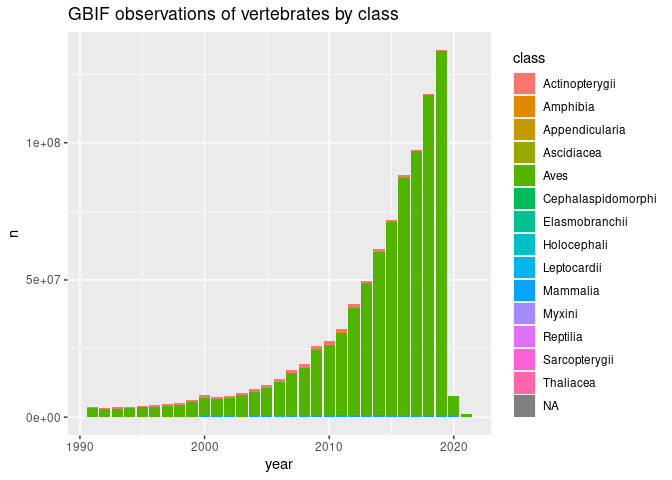
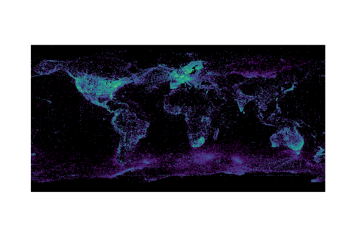

<!-- README.md is generated from README.Rmd. Please edit that file -->

# gbifdb

<!-- badges: start -->

[](https://github.com/ropensci/gbifdb/actions)
[](https://CRAN.R-project.org/package=gbifdb)
<!-- badges: end -->

The goal of `gbifdb` is to provide a relational database interface to a
`parquet` based serializations of `gbif`’s AWS snapshots of its public
data [^1]. Instead of requiring custom functions for filtering and
selecting data from the central GBIF server (as in `rgbif`), `gbifdb`
users can take advantage of the full array of `dplyr` and `tidyr`
functions which can be automatically translated to SQL by `dbplyr`.
Users already familiar with SQL can construct SQL queries directly with
`DBI` instead. `gbifdb` sends these queries to
[`duckdb`](https://duckdb.org), a high-performance, columnar-oriented
database engine which runs entirely inside the client, (unlike
server-client databases such as MySQL or Postgres, no additional setup
is needed outside of installing `gbifdb`.) `duckdb` is able to execute
these SQL queries directly on-disk against the Parquet data files,
side-stepping limitations of available RAM or the need to import the
data. It’s highly optimized implementation can be faster even than
in-memory operations in `dplyr`. `duckdb` supports the full set of SQL
instructions, including windowed operations like `group_by`+`summarise`
as well as table joins.

`gbifdb` has two mechanisms for providing database connections: one
which the Parquet snapshot of GBIF must first be downloaded locally, and
a second where the GBIF parquet snapshot can be accessed directly from
an Amazon Public Data Registry S3 bucket without downloading a copy. The
latter approach will be faster for one-off operations and is also
suitable when using a cloud-based computing provider in the same region.

## Installation

<!--

You can install the released version of `gbifdb` from [CRAN](https://CRAN.R-project.org) with:

``` r
install.packages("gbifdb")
```

-->

And the development version from [GitHub](https://github.com/) with:

``` r
# install.packages("devtools")
devtools::install_github("ropensci/gbifdb")
```

`gbifdb` has few dependencies: `arrow`, `duckdb` and `DBI` are required.

## Getting Started

``` r
library(gbifdb)
library(dplyr)  # optional, for dplyr-based operations
```

### Remote data access

To begin working with GBIF data directly without downloading the data
first, simply establish a remote connection using `gbif_remote()`.

``` r
gbif <- gbif_remote()
```

We can now perform most `dplyr` operations:

``` r
gbif %>%
  filter(phylum == "Chordata", year > 1990) %>%
  count(class, year) %>%
  collect()
#> # A tibble: 461 × 3
#>    class           year       n
#>    <chr>          <int>   <int>
#>  1 Actinopterygii  2003  696289
#>  2 Actinopterygii  2009 1152201
#>  3 Elasmobranchii  2009   67477
#>  4 Actinopterygii  2010 1348109
#>  5 Elasmobranchii  2003   22638
#>  6 Ascidiacea      2013    9151
#>  7 Actinopterygii  2002  777535
#>  8 Actinopterygii  2008 1311066
#>  9 Elasmobranchii  2008   64769
#> 10 Elasmobranchii  2002   21948
#> # … with 451 more rows
```

By default, this relies on an `arrow` connection, which currently lacks
support for some more complex windowed operations in `dplyr`. A user can
specify the option `to_duckdb = TRUE` in `gbif_remote()` (or simply pass
the connection to `arrow::to_duckdb()`) to create a `duckdb` connection.
This is slightly slower at this time. Keep in mind that as with any
database connection, to use non-`dplyr` functions the user will
generally need to call `dplyr::collect()`, which pulls the data into
working memory.  
Be sure to subset the data appropriately first (e.g. with `filter`,
`summarise`, etc), as attempting to `collect()` a large table will
probably exceed available RAM and crash your R session!

When using a `gbif_remote()` connection, all I/O operations will be
conducted over the network storage instead of your local disk, without
downloading the full dataset first. Consequently, this mechanism will
perform best on platforms with faster network connections. These
operations will be considerably slower than they would be if you
download the entire dataset first (see below, unless you are on an AWS
cloud instance in the same region as the remote host), but this does
avoid the download step all-together, which may be necessary if you do
not have 100+ GB free storage space or the time to download the whole
dataset first (e.g. for one-off queries).

### Local data

For extended analysis of GBIF, users may prefer to download the entire
GBIF parquet data first. This requires over 100 GB free disk space, and
will be a time-consuming process the first time. However, once
downloaded, future queries will run much much faster, particularly if
you are network-limited. Users can download the current release of GBIF
to local storage like so:

``` r
gbif_download()
```

By default, this will download to the dir given by `gbif_dir()`.  
An alternative directory can be provided by setting the environmental
variable, `GBIF_HOME`, or providing the path to the directory containing
the parquet files directly.

Once you have downloaded the parquet-formatted GBIF data, `gbif_local()`
will establish a connection to these local parquet files.

``` r
gbif <- gbif_local()
gbif
#> # Source:   lazy query [?? x 48]
#> # Database: duckdb_connection
#>        gbifid datasetkey    occurrenceid kingdom phylum class order family genus
#>         <dbl> <chr>         <chr>        <chr>   <chr>  <chr> <chr> <chr>  <chr>
#>  1 1572326202 0e2c20a3-3c3… 7B3E9B63FF9… Animal… Arthr… <NA>  Aran… Capon… Medi…
#>  2 1572326211 0e2c20a3-3c3… 7B3E9B63FF8… Animal… Arthr… <NA>  Aran… Capon… Medi…
#>  3 1572326213 0e2c20a3-3c3… 7B3E9B63FF9… Animal… Arthr… <NA>  Aran… Capon… Medi…
#>  4 1572326222 0e2c20a3-3c3… 7B3E9B63FF8… Animal… Arthr… <NA>  Aran… Capon… Medi…
#>  5 1572326224 0e2c20a3-3c3… 7B3E9B63FF8… Animal… Arthr… <NA>  Aran… Capon… Medi…
#>  6 1572326210 0e2c20a3-3c3… 7B3E9B63FF9… Animal… Arthr… <NA>  Aran… Capon… Medi…
#>  7 1572326209 0e2c20a3-3c3… 7B3E9B63FF8… Animal… Arthr… <NA>  Aran… Capon… Medi…
#>  8 1572326215 0e2c20a3-3c3… 7B3E9B63FF8… Animal… Arthr… <NA>  Aran… Capon… Medi…
#>  9 1572326228 0e2c20a3-3c3… 7B3E9B63FF8… Animal… Arthr… <NA>  Aran… Capon… Medi…
#> 10 1572326205 0e2c20a3-3c3… 7B3E9B63FF8… Animal… Arthr… <NA>  Aran… Capon… Medi…
#> # … with more rows, and 39 more variables: species <chr>,
#> #   infraspecificepithet <chr>, taxonrank <chr>, scientificname <chr>,
#> #   verbatimscientificname <chr>, verbatimscientificnameauthorship <chr>,
#> #   countrycode <chr>, locality <chr>, stateprovince <chr>,
#> #   occurrencestatus <chr>, individualcount <int>, publishingorgkey <chr>,
#> #   decimallatitude <dbl>, decimallongitude <dbl>,
#> #   coordinateuncertaintyinmeters <dbl>, coordinateprecision <dbl>, …
```

``` r
colnames(gbif)
#>  [1] "gbifid"                           "datasetkey"                      
#>  [3] "occurrenceid"                     "kingdom"                         
#>  [5] "phylum"                           "class"                           
#>  [7] "order"                            "family"                          
#>  [9] "genus"                            "species"                         
#> [11] "infraspecificepithet"             "taxonrank"                       
#> [13] "scientificname"                   "verbatimscientificname"          
#> [15] "verbatimscientificnameauthorship" "countrycode"                     
#> [17] "locality"                         "stateprovince"                   
#> [19] "occurrencestatus"                 "individualcount"                 
#> [21] "publishingorgkey"                 "decimallatitude"                 
#> [23] "decimallongitude"                 "coordinateuncertaintyinmeters"   
#> [25] "coordinateprecision"              "elevation"                       
#> [27] "elevationaccuracy"                "depth"                           
#> [29] "depthaccuracy"                    "eventdate"                       
#> [31] "day"                              "month"                           
#> [33] "year"                             "taxonkey"                        
#> [35] "specieskey"                       "basisofrecord"                   
#> [37] "institutioncode"                  "collectioncode"                  
#> [39] "catalognumber"                    "recordnumber"                    
#> [41] "identifiedby"                     "dateidentified"                  
#> [43] "license"                          "rightsholder"                    
#> [45] "recordedby"                       "typestatus"                      
#> [47] "establishmentmeans"               "lastinterpreted"
```

Now, we can use `dplyr` to perform standard queries:

``` r
growth <- gbif %>%
  filter(phylum == "Chordata", year > 1990) %>%
  count(class, year) %>% arrange(year)
growth
#> # Source:     lazy query [?? x 3]
#> # Database:   duckdb_connection
#> # Groups:     class
#> # Ordered by: year
#>    class               year      n
#>    <chr>              <int>  <dbl>
#>  1 Cephalaspidomorphi  1991   1152
#>  2 Elasmobranchii      1991  17521
#>  3 Ascidiacea          1991   1602
#>  4 Thaliacea           1991    669
#>  5 Amphibia            1991  18443
#>  6 Sarcopterygii       1991     13
#>  7 Leptocardii         1991     36
#>  8 <NA>                1991    912
#>  9 Actinopterygii      1991 363791
#> 10 Holocephali         1991   1048
#> # … with more rows
```

Recall that when database connections in `dplyr`, the data remains in
the database (i.e. on disk, not in working RAM).  
This is fine for any further operations using `dplyr`/`tidyr` functions
which can be translated into SQL.  
Using such functions we can usually reduce our resulting table to
something much smaller, which can then be pulled into memory in R for
further analysis using `collect()`:

``` r
library(ggplot2)
library(forcats)
# GBIF: the global bird information facility?
growth %>%
 collect() %>%
  mutate(class = fct_lump_n(class, 6)) %>%
  ggplot(aes(year, n, fill=class)) + geom_col() +
  ggtitle("GBIF observations of vertebrates by class")
```



## Visualizing all of GBIF

Database operations such as rounding provide an easy way to “rasterize”
the data for spatial visualizations. Here we quickly generate where
color intensity reflects the logarithmic occurrence count in that pixel:

``` r
library(terra)
library(viridisLite)

db <- gbif_local()
df <- db |> mutate(latitude = round(decimallatitude,1),
                   longitude = round(decimallongitude,1)) |> 
  count(longitude, latitude) |> 
  collect() |> 
  mutate(n = log(n))

r <- rast(df, crs="epsg:4326")
plot(r, col= viridis(1e3), legend=FALSE, maxcell=6e6, colNA="black", axes=FALSE)
```



## Performance notes

Because `parquet` is a columnar-oriented dataset, performance can be
improved by including a `select()` call at the end of a dplyr function
chain to only return the columns you actually need. This can be
particularly helpful on remote connections using `gbif_remote()`.

[^1]: all CC0 and CC-BY licensed data in GBIF that have coordinates
    which passed automated quality checks, \[see GBIF
    docs\]<https://github.com/gbif/occurrence/blob/master/aws-public-data.md>)
